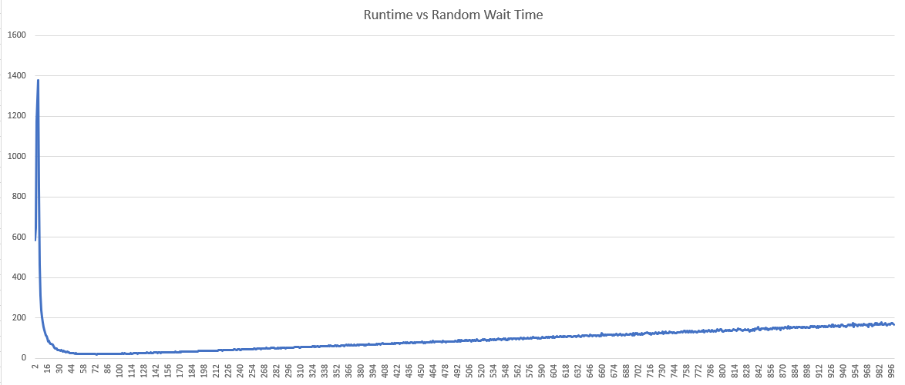
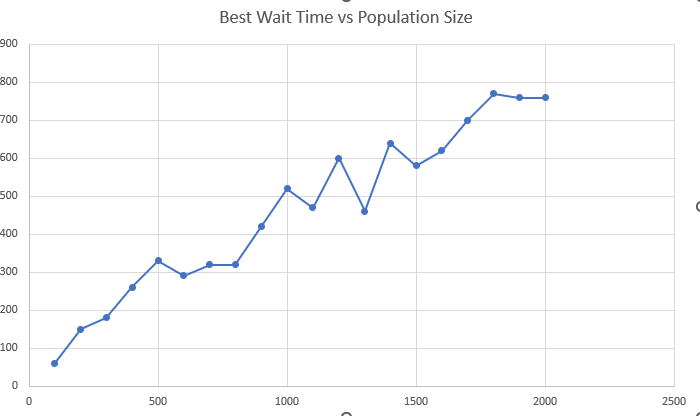
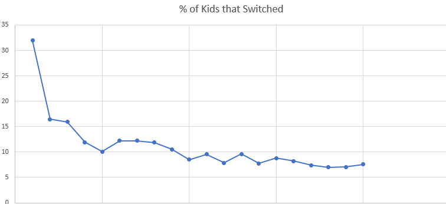

As I watched my son's hockey practice, the coach asked the kids (about 20) to split up into 4 separate lines at different corners of the rink. The kids scattered, not choosing evenly weighted lines. After a few iterations, they eventually settled on an arrangement. This struck me as a surprisingly difficult problem, especially if done without coordination, as kids often forgo. In fact, it seemed like an extremely basic problem statement to try out some basic ideas of distributed systems.

# Methods
## The control group
Theoretically a distributed system would solve this problem well with minimum coordination, but a coordinated synchronous method does exist. By "counting off" (having each kid say a number 1-4 in order), an arrangement could be found in linear time. Each kid would say a number in order and then go to the cooresponding location in the rink. Any distributed method must scale better than this to be worth considering.

## The distributed oscillation
* Each kid goes to a random line to start
* Each kid observes the arrangement
* If the kid is not in a line that is undersized, they immediately leave that line to go to the most undersized line
* Repeat until all lines are optimal
  
Unless the initially random arrangement is optimal, this will oscillate forever, with all oversized lines flooding the most undersized line, which inevitably becomes an oversized line and so forth.

## The random wait
* Each kid goes to a random line to start
* Each kid observes the arrangement
* Each kid waits a random time (W) 
* After the wait is up, the kid, if in an oversized line will leave to go to the most undersized line
* Repeat until all lines are optimal

The introduction of a random wait prevents the system from entering a synchronized oscillation and as we will see performs quite favorably vs the control method.

### Choosing a wait time
If each kid must choose a random time to wait (W), what range should W be within? What is the optimal wait time (Wo) for the population? 

#### 100 population size
First lets choose a population size of 100 and a broad variety of wait times.

This data shows three regimes
1. The early part of the graph demonstrates poor results when W is choosen to be small, and does not effectively de-synchronize the system
1. The next portion of the graph shows the performance rapidly improving as the system not only de-synchronizes, but encourages a portion of kids to not switch lines at all.
1. The final portion, shows a linear increase as many kids have chosen very long wait times but are needed to switch lines.

In this example Wo ~ 70. This seems rather high when the total execution time is much lower than 70 cycles. The reason is the kids are choosing a wait time between 1 and 70. Those that choose a high wait time will never switch and will stay in the line they first chose. Since the total execution time is only 20 cycles, That means that only kids that chose a W < 20 will have ever switched lines. Approximatly 5/7 of kids (~70%) will never switch lines. Through random, uncoordinated action, 70% of the participants make the correct choice on their first attempt. Only 30% have any further work to do. I believe this is the heart of the advantage.

#### Many sizes
So, is it true that Wo ~70s for all times then? No. we can expand our experiment to find the best performing Wo for each population size.

Our Wo keeps increasing for each increase in population size. Why is this? Because we continue to increase the chances that a kid does not move at all. In fact, as population grows, the percentage of kids that need to move falls as seen here:

.

The wait times appear to be adjusting to ensure only 7% of kids switch lines as a limit, but I cannot explain why.

